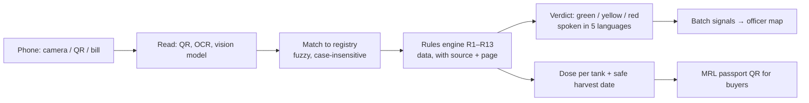

# DawaCheck

**Plantix tells you the disease. DawaCheck tells you whether the pesticide the dealer handed you is genuine, approved for your crop, safe to mix, and when your harvest is safe to sell.**

DawaCheck is a voice-first app that checks a pesticide at the moment of purchase: is it registered, approved for this crop and pest, safe to mix, and how much to spray. It then follows the spray through to a safe harvest date. Built from the *DawaCheck: Complete Hackathon Playbook* (AgriTech track).

> **AI reads, rules decide.** OCR and an LLM only turn photos and text into structured fields. Every verdict, dose and date comes from a deterministic rules engine (R1–R13, stored as data) that cites its source file and page.

## For judges: try it in 60 seconds

**Live site:** https://dawacheck-theta.vercel.app/ · **Officer dashboard:** https://dawacheck-theta.vercel.app/#/officer · **API docs:** https://dawacheck-theta.vercel.app/api/docs

1. Open the website on a laptop or phone. Under **"Try it now: no packet needed"**, tap each sample product:
   - **Emacure**: green, with dose per tank, safety gear and the safe harvest date.
   - **Blastguard 75**: yellow, not approved for cotton, with approved alternatives (rule R5).
   - **Tricy Plus**: red, banned for basmati in Punjab (rule R7).
   - **Profex 50**: red, this batch was reported by other farmers (rule R8).
2. Tap **Why?** on any verdict: every rule cites its source file and page.
3. Switch the language (हिंदी, मराठी, ਪੰਜਾਬੀ, తెలుగు) and tap **Listen again**: the verdict is spoken.
4. Open **Officer / FPO dashboard**: suspicious-batch map, reports, impact numbers.
5. Try **Mix check** (Chlorokill 20 + Pyrikill: double dose, R9) and **SOS** (doctor card).



**Why it is different:** the AI only reads; every decision comes from auditable rules with citations, so a verdict can be checked by an officer. It never calls a product "fake": it says "not in the registry" or "reported by farmers".

## ⚠️ Read this before any demo or field use

| What | Status |
|---|---|
| Label claims (crop × pest × dose × waiting period) in `backend/data/seed/label_claims.json` | **SAMPLE DATA.** Not yet parsed from the CIB&RC *Major Uses* PDFs (ppqs.gov.in was blocked from the build environment). Marked `verified: false` and shown in the app as sample data. Run `pipeline/` to replace them. |
| Product catalogue (`backend/data/seed/products.json`, 50 products) | **Fictional brands, companies and registration numbers**, so no real company is misrepresented. Replace with the parsed registered-products list and labels you photograph. |
| Banned / restricted flags, IRAC/FRAC/HRAC groups (84 chemicals), toxicity colours | Hand-made enrichment table. Re-check bans against the current CIB&RC list; copy toxicity colours from each real label. |
| Facts on slides | From the sources linked in the playbook, with exact URLs in [`docs/DATA_SOURCES.md`](docs/DATA_SOURCES.md). Re-open each before quoting it. |
| Hindi, Marathi, Punjabi, Telugu text | Drafts. Review with native speakers. |
| OCR accuracy | Harness built (`scripts/accuracy_report.py`); run it on your 50 real pack photos. Synthetic-label numbers are only a self-test. |

A verdict never says "fake". It says "not found in the government registry" or "reported by other farmers". Only a lab test proves a product is spurious.

## Quick start

**Deploying (Vercel, Render or Docker): see [`docs/DEPLOY.md`](docs/DEPLOY.md).**

### One command (Docker)
```bash
cp .env.example .env          # optional: ANTHROPIC_API_KEY for LLM extraction, ADMIN_TOKEN for the admin screen
docker compose up --build
```
Open **http://localhost:8000/app/** (farmer app), **/app/officer** (dashboard), **/docs** (API). The stack: PostgreSQL + PostGIS, Redis (cache + OCR queue), RQ worker, MinIO, and the app (with Tesseract OCR).

### Without Docker (laptop demo, SQLite)
```bash
sudo apt-get install tesseract-ocr        # optional OCR engine for label photos
pip install -r backend/requirements-full.txt
cd frontend && npm install && npm run build && cd ..
cd backend && python -m app.seed --reset && ADMIN_TOKEN=change-me uvicorn app.main:app --port 8000
```
Frontend hot reload: `cd frontend && npm run dev`, then http://localhost:5173/app/.
On stage with unreliable Wi-Fi set `DAWACHECK_OFFLINE=1`: no external calls; the spray window can be simulated with `/weather-window?demo=rain`.

### Tests
```bash
cd backend && python -m pytest -q                      # 121 tests
TEST_DATABASE_URL=postgresql+psycopg://user@host/db python -m pytest -q   # same suite on PostgreSQL + PostGIS
```
Covers every rule, every endpoint, dose maths, extraction, a real Tesseract photo-OCR run, the PDF parsers, the admin flows, the job queue, the impact metrics and the 30 knowledge-base questions.

## What is built

### Core features (section 5)
| # | Feature | How |
|---|---|---|
| C1 | Scan | Live camera with guide box and automatic QR detection (BarcodeDetector / jsQR, OpenCV on the server); label photo → OCR (PaddleOCR or Tesseract, with deskew and contrast) → LLM to strict JSON (schema + few-shot, regex fallback) → rapidfuzz match; confirm screen with the pack photo, brand read aloud and a photo crop of every field read |
| C2 | Registry check | Rules R1 (not registered / reg. no. mismatch), R2 (banned or restricted, with effective dates), R3/R4 (expiry), D1 (data incomplete) |
| C3 | Label-claim check | R5/R6 with approved alternatives (state-banned options removed) |
| C4 | Dose to tank | ml/g per tank and number of tanks, measuring-cap drawing; granules in kg per acre |
| C5 | Waiting period | Safe harvest date (R12), on-phone reminder + notification, calendar (.ics) |
| C6 | Toxicity and safety | Colour meaning, gear icons, first aid and antidote from the label, separate red-label confirmation screen |
| C7 | Spray window | Open-Meteo forecast → R13 (rain, wind, heat) |
| C8 | Language and voice | English, Hindi, Marathi, Punjabi, Telugu; phone language by default; spoken verdicts (pre-recorded clips when present, else the phone's TTS); colour + icon + sound |

### WOW features (section 6)
| # | Feature | How |
|---|---|---|
| W1 | Bill Scan | Bill OCR → line items → checks per item → cheapest same chemical "seen near you"; prices learnt from bills |
| W2 | Cocktail Checker | Scan 2–4 packs with the camera or pick them; duplicate a.i., same IRAC/FRAC group, toxicity stacking, jar-test hint; tank drawing and "remove this" |
| W3 | MRL Passport | Spray diary, latest safe date, state-ban and EU flags, QR to a public page |
| W4 | Doctor Card + SOS | NPIC 1800 116 117, 108, first aid from the label, nearest health centres; full-screen Doctor Card in English + the farmer's language with time of last spray |
| W5 | Rotation Planner | Last two sprays in the same group → approved options from other groups |
| W6 | Fake-Batch Radar | Date conflicts, cloned QR (PostGIS distance), not in registry, farmer reports with photos; heat map, ranked batches, batch timeline with shops |

### Around them
- **Officer / FPO dashboard:** map with heat layer, district chart, suspicious batches, batch detail (confirm or dismiss reports), FPO export view, **Impact** tab (section 17 metrics), **Admin** tab.
- **Admin (section 18):** add a state crop ban or national ban with an effective date in minutes; review farmer-added products (with photo) before they enter the catalogue.
- **Offline:** installable app shell, cached catalogue and verdicts for products already scanned.
- **Queue:** label-photo OCR runs as a job (`/scan/async` → `/jobs/{id}`) on an RQ worker.
- **Data pipeline:** Major Uses, registered products, banned list, EU MRL import (`pipeline/`).
- **Pitch material:** 10-slide deck with real app screenshots, demo script, judge Q&A, evaluation mapping, business and risks (`docs/`).

API: `POST /scan`, `POST /scan/async`, `GET /jobs/{id}`, `POST /bill`, `POST /mix-check`, `GET /claims`, `POST /dose`, `POST /spray-log`, `GET /passport/{plot_id}`, `GET /reminder.ics`, `GET /rotation`, `GET /sos`, `GET /weather-window`, `POST /report`, `GET /radar`, `GET /radar/batch`, `GET /fpo/plots`, `GET /metrics`, `POST /products/submit`, `/admin/*`, `GET /products`, `GET /crops`, `GET /offline-pack`, `GET /i18n/{lang}`, `POST /explain`, `GET /health`. Interactive docs at `/docs`.

## Architecture
```
Farmer app (PWA)      Officer / FPO dashboard      MRL Passport page
        \                     |                          /
                    FastAPI backend (backend/app/main.py)
        |                     |                          |
 AI reading layer  ->   Rules engine R1-R13   <-   Supporting services
 QR, OCR (+queue),      rules.json (data)          weather, SOS, radar,
 LLM->JSON, fuzzy       worst colour wins          admin, metrics
                        cites file + page
        |                     |
 Photo storage         Knowledge base: PostgreSQL + PostGIS (SQLite for tests)
 MinIO / S3 / disk     label_claims, products, bans, export_flags, scans, spray_log,
                       batch_signals, prices, reports, submissions, bill_checks
                              ^
     Offline pipeline: CIB&RC PDFs -> pdfplumber/camelot -> normalise -> validate -> load
```
**Guardrails:** the LLM never outputs a verdict, dose or date; extraction must pass a JSON schema and regex cross-checks, and the strength/form read must match the registered formulation; low-confidence fields are shown to the farmer as photo crops; "Why?" text is discarded if it contains any number not in the fired rules or the retrieved rows; every scan is logged (image hash, extracted JSON, fired rules); no phone numbers are collected (salted hash of a device id); location only if the phone shares it.

## Data pipeline
```bash
python -m pipeline.run --download --load        # URLs in pipeline/sources.json (from the playbook)
python -m pipeline.import_eu_mrl eu-export.csv  # optional EU MRL flags
cd backend && python -m pytest tests/test_kb_questions.py
```
Review `data/interim/review.csv`, then rewrite `backend/data/kb_questions.json` answers from the PDF pages.

## Honest limits
- Tank-mix checks cover duplicates, resistance group and toxicity only; no prediction of chemical reactions.
- The MRL Passport is a self-declared record plus a risk estimate, not a lab certificate.
- The SOS screen repeats label text and routes to professionals; it gives no treatment advice of its own.
- DawaCheck is a responsive website (laptop and phone, installable to the home screen) rather than a Flutter/React Native app; the playbook says its stack is "a default, not a rule", and all logic is in the API, so native screens can be added.
- Crop/pest pictures are emoji until real photos are added to `frontend/public/img/`; pre-recorded voice clips are generated with `scripts/make_voice_clips.py` (needs internet or a local TTS model).

See [`docs/`](docs/) for the demo script, judge Q&A, sources, evaluation mapping, business, risks and the final checklist.
